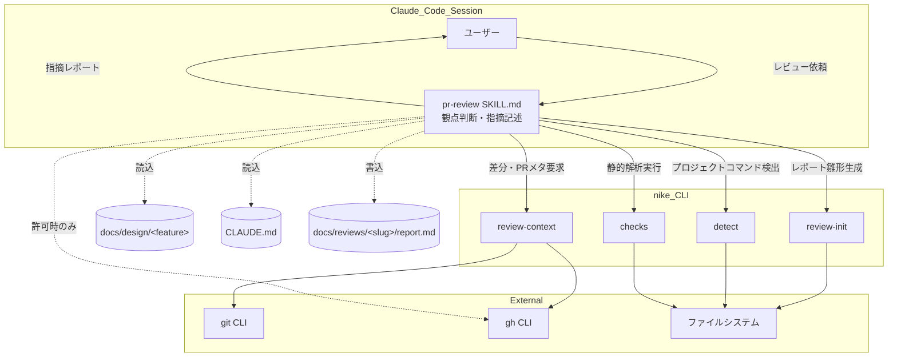
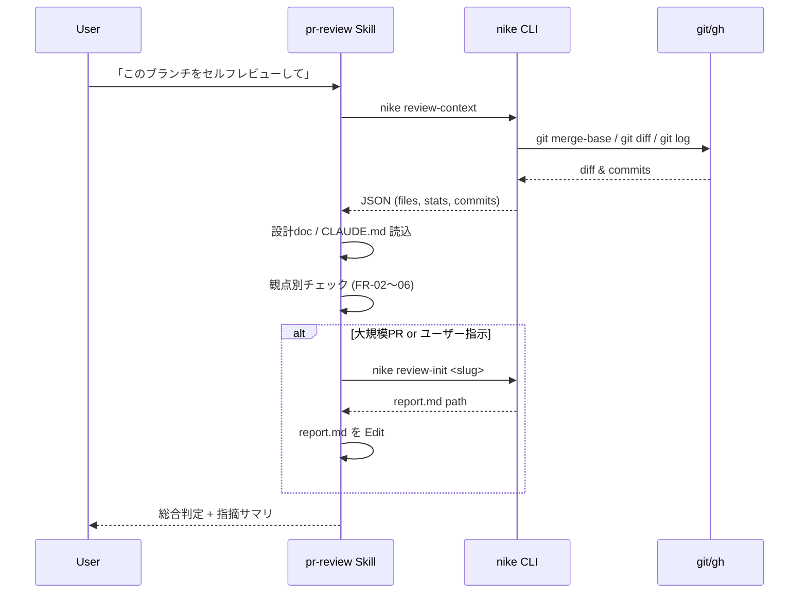
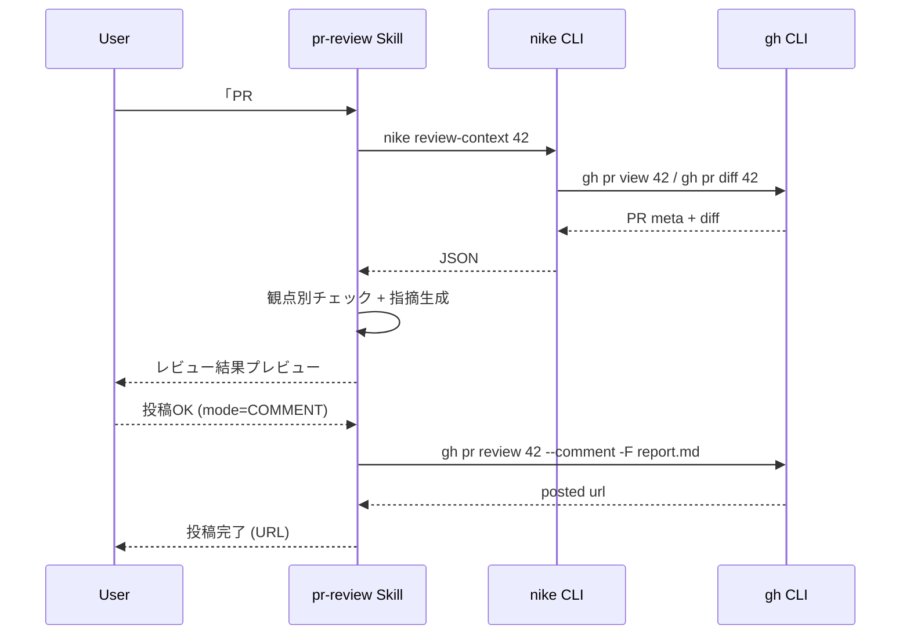
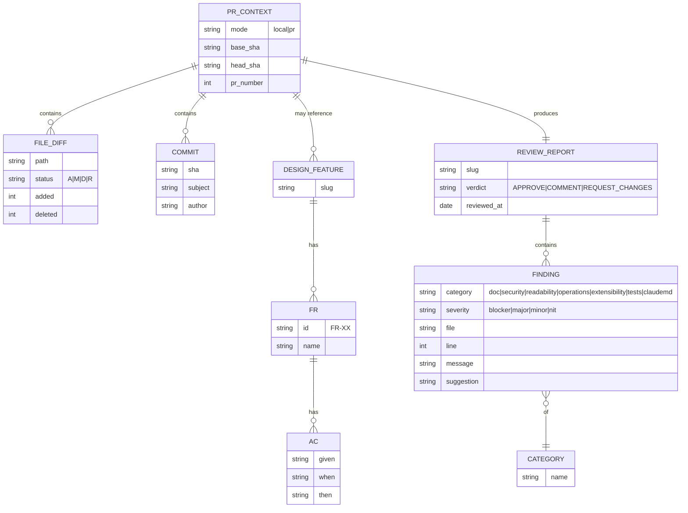

# 基本設計: PR Review

最終更新: 2026-05-08
関連: [requirements.md](./requirements.md)

## 1. アーキテクチャ概要

`pr-review` Skill は **Skill 本体 (SKILL.md)** と **nike CLI のサブコマンド** に責務を分離する。Skill が観点ごとの判断と表現に集中し、決定的処理（差分取得・PR メタ取得・レポート雛形生成）は CLI が担う。これは既存 4 Skill と同じ思想。



各層の責務:

| 層 | 役割 |
|----|------|
| Skill (SKILL.md) | レビュー観点の判断、指摘文の生成、ユーザーとの対話、許可制で `gh pr review` 起動 |
| nike CLI | 差分・PR メタ取得、レポート雛形生成、プロジェクトコマンド検出、静的解析の一括実行 |
| 外部ツール | `git`, `gh`, ファイルシステム操作（CLI 経由） |
| 成果物 | `docs/reviews/<slug>/report.md` (大規模 PR 時のみ生成) |

## 2. コンポーネント

### 2.1 Skill: `skills/pr-review/SKILL.md`
- 責務:
  - レビュー対象の特定方針をユーザーと合意（ローカル差分 / PR 番号）
  - `nike review-context` で差分・メタを取得
  - 観点ごと（FR-02〜FR-06）の指摘候補を生成
  - レポート出力（チャット中心、必要時はファイル）
  - GitHub 投稿は **必ずユーザー確認の上で実行**
- 入力: ユーザー指示、差分、PR メタ、設計ドキュメント、CLAUDE.md
- 出力: チャットへのレビュー結果、(オプション) `docs/reviews/<slug>/report.md`、(許可時) PR コメント
- 依存: nike CLI、Bash ツール、Read ツール

### 2.2 CLI: `nike review-context [<pr>]`
- 責務: レビュー対象の差分メタデータを集める決定的処理
- 入力:
  - 引数なし → 現在のブランチ vs `git merge-base origin/main` の差分
  - 引数 `<pr-number>` または `<url>` → `gh pr view` / `gh pr diff` 経由
  - `--base <ref>` で base ブランチを上書き可
- 出力 (JSON):
  ```json
  {
    "mode": "local|pr",
    "base": {"ref": "main", "sha": "abc..."},
    "head": {"ref": "feat/x", "sha": "def..."},
    "pr": {"number": 42, "title": "...", "url": "...", "author": "...", "labels": [...]} | null,
    "files": [
      {"path": "scripts/nike.py", "status": "M", "added": 30, "deleted": 5}
    ],
    "stats": {"files_changed": 12, "added": 300, "deleted": 50},
    "commits": [{"sha": "...", "subject": "...", "author": "..."}],
    "design_features": ["pr-review"],
    "claude_md": "CLAUDE.md" | null
  }
  ```
- 依存: `git`, `gh`（PR モード時）

### 2.3 CLI: `nike review-init <slug>`
- 責務: `docs/reviews/<slug>/report.md` を観点別セクション付きで生成
- 入力: feature slug（PR 番号や日付ベースでも可、kebab-case）
- 出力: `report.md` を作成し、JSON でパスを返す
- テンプレート: `scripts/templates/review-report.md`（新規追加）

### 2.4 既存 CLI の再利用
- `nike status <slug>` — 設計ドキュメント有無の確認
- `nike parse-requirements <slug>` — FR/AC を取り、整合チェックの根拠にする
- `nike detect` — プロジェクトのテスト・lint コマンドを推定
- `nike checks` — 必要に応じてレビュー時にも静的解析を実行

## 3. データフロー

### 3.1 シナリオ A: ローカルブランチのセルフレビュー



### 3.2 シナリオ B: GitHub PR レビュー（投稿許可あり）



## 4. データモデル

レビュープロセス中に扱うデータの関係。永続化はしない（report.md がスナップショット）。



## 5. 外部インターフェース

### 5.1 Skill 起動トリガ（user prompt 例）
- 「PR レビューして」「このブランチをセルフレビューして」 → ローカルモード
- 「PR #42 をレビューして」「<github-url> をレビューして」 → PR モード
- 「ドキュメント整合だけ確認して」 → 観点を制限したレビュー

### 5.2 CLI サブコマンド一覧（新規）
- `nike review-context [<pr>] [--base <ref>]` → JSON
- `nike review-init <slug> [--force]` → JSON `{status, slug, report_path}`

### 5.3 出力先
- 既定: チャット（Claude のテキストレスポンス）
- 大規模 PR / 明示指示時: `docs/reviews/<slug>/report.md`
- 許可制: `gh pr review <num> --comment|--approve|--request-changes -F <report>`

## 6. エラー処理方針

| 事象 | 検出箇所 | 振る舞い |
|------|---------|---------|
| `git` 不在 | `nike review-context` | JSON `{"error": "git not found"}` を返し exit 1。Skill はユーザーに伝えて中断 |
| `gh` 未認証（PR モード） | `nike review-context` | `{"error": "gh auth required"}` を返し exit 1 |
| PR 番号が存在しない | `nike review-context` | `gh` のエラー出力を `error.detail` に格納し exit 1 |
| `docs/design/<slug>/` 不在 | Skill | レビューはスキップせず継続。「設計ドキュメント未検出」をレポートに明記 |
| CLAUDE.md 不在 | Skill | プロジェクト固有の暗黙契約チェックをスキップ。レポートに明記 |
| `gh pr review` 投稿失敗 | Skill | エラー詳細をレポートに記録し、ユーザーに再実行 / 手動投稿の選択肢を提示 |
| 巨大 PR でトークン圧迫の懸念 | Skill | `nike review-context` の `stats.files_changed` を見て分割レビュー方針を提案 |
| 認証情報を検出 | Skill | レビュー結果には**マスク**して載せ、生の値はチャット・レポートに出さない |

すべて nike CLI のエラーは JSON 構造を保つ（既存方針）。Skill 側で JSON.parse して扱う。

## 7. 設計判断ログ

| # | 判断 | 採用案 | 却下案 | 理由 |
|---|------|-------|-------|------|
| 1 | レビュー対象の特定方法 | `nike review-context` に集約（ローカル/PR 両対応） | Skill が直接 git/gh を叩く | Skill ロジックを薄くし、CLI 側で単体テスト可能にするため |
| 2 | 投稿モードの既定 | デフォルト「チャット出力のみ」、投稿は明示許可 | デフォルトで `gh pr review --comment` 投稿 | 誤投稿の不可逆性が高く、セルフレビューの想定では投稿しないケースが多い |
| 3 | レポートのファイル化条件 | 大規模 PR か明示指示時のみ `docs/reviews/<slug>/report.md` を作成 | 常にファイル生成 | 小規模 PR でファイルが増えると履歴ノイズになる |
| 4 | 観点の取得元 | CLAUDE.md + 内蔵の固定観点 | 観点を YAML 外部化 | v0.4 の MVP では複雑度を抑える。外部化はオープンイシュー扱い |
| 5 | 設計ドキュメント整合の対象推定 | 差分ファイルパス → feature slug の機械的マッチ + ユーザー確認 | パスから完全自動推定 | feature slug とコードパスの対応は必ずしも自明でないため、不明時はユーザーに聞く |
| 6 | 認証情報検出 | 正規表現ベースの簡易検出 + マスク | 機密スキャナーを丸ごと統合 | stdlib のみという既存制約と整合。既存 `nike scan` のパターンを再利用可能なら流用 |
| 7 | サブコマンド命名 | `review-context`, `review-init` | `pr-context`, `pr-init` | 既存 `verify-init`, `impl-init` の命名規則と揃える |
| 8 | レポート雛形のテンプレート | `scripts/templates/review-report.md` を新規追加 | Skill 側で文字列を埋め込み生成 | 既存 `requirements.md` 等と同じ「テンプレ＋プレースホルダ置換」方式に揃える |
