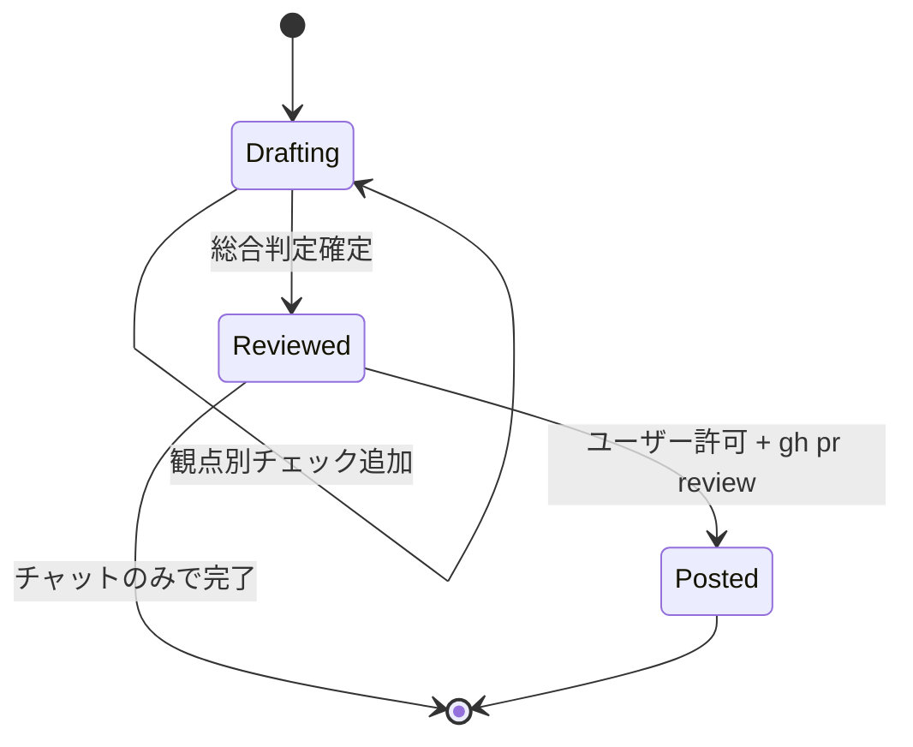

# 詳細設計: PR Review

最終更新: 2026-05-08
関連: [basic-design.md](./basic-design.md)

## 1. ファイル構成

```
.
├── .claude-plugin/
│   ├── plugin.json                       # version bump (minor)
│   └── marketplace.json                  # version bump
├── README.md                             # pr-review Skill とサブコマンドを追記
├── docs/
│   ├── design/pr-review/                 # 本設計群
│   └── reviews/                          # 実行時のみ生成 (gitignore 対象でも可)
├── scripts/
│   ├── nike.py                           # review-context / review-init を追加
│   ├── templates/
│   │   └── review-report.md              # 新規: レポート雛形
│   └── tests/
│       └── test_nike.py                  # ReviewContext / ReviewInit テストを追加
└── skills/
    └── pr-review/
        └── SKILL.md                      # 新規: Skill 本体
```

`docs/reviews/<slug>/report.md` は実行時に生成。コミット必須ではない（チームポリシー次第）。

## 2. クラス・関数仕様

### 2.1 `scripts/nike.py`

#### `cmd_review_context(args) -> None`
- **説明**: ローカル差分または GitHub PR のメタ情報を JSON で出力する。
- **パラメータ**:
  - `args.pr` (str | None): PR 番号 (`42`, `#42`) または URL。未指定時はローカルモード。
  - `args.base` (str | None): base ref 上書き。未指定時は PR モードでは PR の baseRefName、ローカルモードでは `git remote show origin` の HEAD branch（取得失敗時 `main`）。
- **戻り値**: なし（`emit()` で JSON を stdout）
- **副作用**: `git`, `gh` をサブプロセス実行
- **例外/エラー**:
  - `git` 不在 → `{"error": "git not found"}` exit 1
  - PR モードで `gh` 不在 / 未認証 → `{"error": "gh required for PR mode", "detail": "..."}` exit 1
  - 不正な PR 指定 → `{"error": "pr not found", "detail": "<gh stderr>"}` exit 1
- **出力スキーマ**:
  ```json
  {
    "mode": "local|pr",
    "base": {"ref": "main", "sha": "abc1234"},
    "head": {"ref": "feat/x", "sha": "def5678"},
    "pr": null | {
      "number": 42,
      "title": "...",
      "url": "https://github.com/owner/repo/pull/42",
      "author": "user",
      "labels": ["enhancement"],
      "base_ref": "main",
      "head_ref": "feat/x"
    },
    "files": [
      {"path": "scripts/nike.py", "status": "M", "added": 30, "deleted": 5}
    ],
    "stats": {"files_changed": 12, "added": 300, "deleted": 50},
    "commits": [
      {"sha": "abc1234", "subject": "feat: ...", "author": "User <u@example.com>"}
    ],
    "design_features": ["pr-review"],
    "claude_md": "CLAUDE.md" | null
  }
  ```
- **内部処理（疑似コード）**:
  ```
  ensure_git_available()
  if args.pr is None:
      mode = "local"
      base_ref = args.base or detect_default_branch()  # origin/HEAD → main fallback
      head_ref = current_branch()
      base_sha = git("merge-base", base_ref, "HEAD")
      head_sha = git("rev-parse", "HEAD")
      pr_meta = None
  else:
      mode = "pr"
      ensure_gh_available_and_authed()
      meta = json.loads(gh("pr", "view", normalize_pr(args.pr), "--json",
                           "number,title,url,author,labels,baseRefName,headRefName,baseRefOid,headRefOid"))
      base_ref = args.base or meta["baseRefName"]
      head_ref = meta["headRefName"]
      base_sha = meta["baseRefOid"]
      head_sha = meta["headRefOid"]
      pr_meta = {...flatten meta...}

  files = parse_numstat(git("diff", "--numstat", f"{base_sha}...{head_sha}"))
  status_map = parse_name_status(git("diff", "--name-status", f"{base_sha}...{head_sha}"))
  for f in files: f["status"] = status_map.get(f["path"], "M")
  stats = aggregate(files)
  commits = parse_log(git("log", f"{base_sha}..{head_sha}", "--pretty=format:%H|%s|%an <%ae>"))

  design_features = match_features_from_paths([f["path"] for f in files])
  claude_md = "CLAUDE.md" if (ROOT/"CLAUDE.md").exists() else None

  emit({...})
  ```

#### `cmd_review_init(args) -> None`
- **説明**: `docs/reviews/<slug>/report.md` を観点別セクション付きの雛形で生成。
- **パラメータ**:
  - `args.slug` (str): kebab-case のレビュー識別子。PR 番号付きでも可（例: `pr-42-2026-05-08`）。
  - `args.force` (bool): 既存ファイルを上書きするか。
- **戻り値**: なし（JSON を `emit()`）
- **出力**:
  ```json
  {
    "status": "ok",
    "slug": "pr-42-2026-05-08",
    "report_path": "docs/reviews/pr-42-2026-05-08/report.md"
  }
  ```
- **エラー**:
  - 既存 + `--force` 無し → `{"error": "report exists", "path": "..."}` exit 1

#### `normalize_pr(value: str) -> str`
- **説明**: `#42`, `42`, `https://github.com/owner/repo/pull/42` を `gh` が受ける形に正規化（数値文字列 or URL）。
- **戻り値**: `gh pr view <X>` に渡せる文字列。

#### `match_features_from_paths(paths: list[str]) -> list[str]`
- **説明**: 差分ファイルパスから `docs/design/<slug>/` の slug を推定する補助。
- **アルゴリズム**:
  1. `docs/design/` 直下のディレクトリ名を全列挙。
  2. 各 slug について以下のヒューリスティクスでマッチ判定:
     - 差分パスが `docs/design/<slug>/` を含む（直接編集）
     - 差分パスのいずれかが slug をハイフン分割した単語の **過半数** を含む
     - パスのトークン (`/`, `_`, `-`, `.` 区切り) と slug トークンの Jaccard 係数が閾値超
  3. マッチした slug をリストで返す（0 件なら空配列）。
- **注意**: 機械推定なので、Skill 側で「合っているか」をユーザーに確認する余地を残す。

#### 既存ヘルパの再利用
- `emit`, `feature_dir`, `rel`, `render_template`, `today_iso` は既存と同じものを使う。
- 新規ヘルパ `run_git(*args) -> str`, `run_gh(*args) -> str` を追加（subprocess.run のラッパ、stderr を `error.detail` に保持）。

### 2.2 `scripts/templates/review-report.md`

新規テンプレート。`{{}}` プレースホルダは `render_template` が置換。

```markdown
# PR Review レポート: {{NAME}}

最終更新: {{DATE}}
モード: {{MODE}}
{{PR_LINE}}
base/head: {{BASE_REF}}@{{BASE_SHA_SHORT}} → {{HEAD_REF}}@{{HEAD_SHA_SHORT}}
変更: {{FILES_CHANGED}} ファイル, +{{ADDED}} / -{{DELETED}}

## 総合判定
- ⬜ APPROVE
- ⬜ COMMENT
- ⬜ REQUEST_CHANGES

理由:

## サマリ
- 強み:
- 主要な懸念:
- 次のアクション:

## 観点別の指摘

### 1. ドキュメント整合 (FR-02)
| # | 重要度 | ファイル:行 | 指摘 | 提案 |
|---|--------|-------------|------|------|

### 2. セキュリティ (FR-03)
| # | 重要度 | ファイル:行 | 指摘 | 提案 |
|---|--------|-------------|------|------|

### 3. 可読性・保守性 (FR-04)
| # | 重要度 | ファイル:行 | 指摘 | 提案 |
|---|--------|-------------|------|------|

### 4. 運用面 (FR-05)
| # | 重要度 | ファイル:行 | 指摘 | 提案 |
|---|--------|-------------|------|------|

### 5. 拡張性・破壊的変更 (FR-05)
| # | 重要度 | ファイル:行 | 指摘 | 提案 |
|---|--------|-------------|------|------|

### 6. テスト網羅 (FR-04)
| # | 重要度 | ファイル:行 | 指摘 | 提案 |
|---|--------|-------------|------|------|

### 7. CLAUDE.md 暗黙契約 (FR-06)
| # | 重要度 | ファイル:行 | 指摘 | 提案 |
|---|--------|-------------|------|------|

## 良い点 (Praise)
-

## 投稿履歴
- (未投稿) / 投稿先 PR: (未指定)
```

`{{MODE}}` は `local` / `pr`。`{{PR_LINE}}` は PR モード時のみ「PR: #42 [タイトル](URL)」、ローカル時は空文字。

### 2.3 `skills/pr-review/SKILL.md`

YAML frontmatter:

```yaml
---
name: pr-review
description: ローカルブランチの差分または GitHub PR をレビューする。設計ドキュメント整合・セキュリティ・可読性・運用・拡張性・テスト網羅・CLAUDE.md 暗黙契約の各観点で指摘を生成し、チャットに出力する。許可制で `gh pr review` 経由の PR コメント投稿にも対応。差分取得・レポート雛形生成は nike CLI に委譲する。「PR レビュー」「セルフレビュー」「PR #N をレビュー」と依頼された場合に使用。
---
```

本文は既存 `verify` SKILL.md と同じ章立て:
1. このスキルの役割
2. nike CLI の活用（`review-context`, `review-init` の表）
3. 使い方（ステップ 1〜7）
4. レビュー観点の詳細
5. 進め方の原則

詳細は実装フェーズで埋める。重要ポイント:
- **ステップ 1（対象特定）**: `nike review-context` を呼び、`mode`, `stats.files_changed` を確認。50 ファイル超ならレポートファイル併用を案内。
- **ステップ 2（前提資料の確認）**: `design_features` 配列に slug があれば `nike parse-requirements <slug>` で AC を取得し整合チェックの根拠にする。`claude_md` が non-null なら CLAUDE.md を Read。
- **ステップ 3（観点別チェック）**: 7 観点を順番に実施。
- **ステップ 4（レポート出力）**: 小規模 → チャット直接、大規模 → `nike review-init` でファイル生成し Edit。
- **ステップ 5（投稿）**: ユーザー許可確認 → `gh pr review <N> --comment -F <report>` を実行。`--approve` / `--request-changes` も同様に許可確認後のみ。

## 3. CLI 仕様

### 3.1 `nike review-context`

| 項目 | 内容 |
|------|------|
| Usage | `nike review-context [<pr>] [--base <ref>]` |
| 引数 | `<pr>`: PR 番号 / URL (省略時ローカルモード) |
| オプション | `--base <ref>`: 比較先ブランチ (例: `origin/main`) |
| Exit Code | 0=成功 / 1=エラー（git/gh 不在、PR 不在等） |
| 出力 | 上記 §2.1 のスキーマ |

### 3.2 `nike review-init`

| 項目 | 内容 |
|------|------|
| Usage | `nike review-init <slug> [--force]` |
| 引数 | `<slug>`: レビュー識別子 (kebab-case) |
| オプション | `--force`: 既存上書き |
| Exit Code | 0=成功 / 1=エラー (既存ファイル且つ --force 無し) |
| 出力 | `{status, slug, report_path}` |

### 3.3 出力例（local モード）

```json
{
  "mode": "local",
  "base": {"ref": "main", "sha": "305ed87"},
  "head": {"ref": "feat/pr-review", "sha": "abc1234"},
  "pr": null,
  "files": [
    {"path": "scripts/nike.py", "status": "M", "added": 80, "deleted": 2},
    {"path": "skills/pr-review/SKILL.md", "status": "A", "added": 120, "deleted": 0}
  ],
  "stats": {"files_changed": 2, "added": 200, "deleted": 2},
  "commits": [
    {"sha": "abc1234", "subject": "feat(pr-review): add review-context", "author": "..."}
  ],
  "design_features": ["pr-review"],
  "claude_md": "CLAUDE.md"
}
```

## 4. DB スキーマ

該当なし（永続ストレージは使わない）。レポートは Markdown として `docs/reviews/<slug>/report.md` に保存。

## 5. 状態遷移

レビューレポートの判定状態:



## 6. テスト観点

### 6.1 ユニット (`scripts/tests/test_nike.py`)
- `TestReviewContextLocal`:
  - `git` 利用可・PR 引数なし → `mode="local"` を返す
  - `git` 不在 (PATH からモック) → exit 1 + `error` キー
  - `--base` 指定で base ref が上書きされる
  - 差分ファイルが空 → `files: []`, `stats.files_changed: 0`
  - `design_features` が `docs/design/<slug>` の存在で正しく抽出される
- `TestReviewContextPR`:
  - `gh` をモック (subprocess を差し替え) し、想定 JSON を返却 → 正しく解釈
  - `gh` 認証エラーをモック → exit 1 + `error.detail`
  - `#42`, `42`, URL 形式が `normalize_pr` で正規化される
- `TestReviewInit`:
  - 新規生成 → `report.md` が作成され、`{{NAME}}` 等が置換されている
  - 既存 + `--force` 無し → exit 1
  - `--force` あり → 上書き成功
- `TestMatchFeaturesFromPaths`:
  - `docs/design/foo/` 直接編集パス → `["foo"]`
  - 名前マッチケース・閾値以下のケースを網羅

### 6.2 統合
- 一時ディレクトリで `git init` → コミット作成 → `nike review-context` で意図した JSON が返ることを確認
- `nike review-init` → `nike status <slug>` 系と矛盾しないこと（`docs/reviews/` は `docs/design/` と独立であることを確認）

### 6.3 スモーク (CI)
- `nike review-context --help`, `nike review-init --help` が exit 0
- `--help` 出力に新サブコマンドが現れる

### 6.4 手動確認
- 自リポジトリの直近 PR を `nike review-context <PR>` で叩いて妥当な JSON が返るか
- pr-review Skill を起動し、`docs/design/pr-review/` の整合チェックが動くこと

## 7. 実装ステップ

依存関係を考慮した実装順:

1. **テンプレート追加**: `scripts/templates/review-report.md` を作成。
2. **`review-init` 実装**: `nike.py` に `cmd_review_init` 追加（テンプレ依存のみで完結）。
3. **`review-init` テスト**: 上記 §6.1 の `TestReviewInit` を追加。緑になることを確認。
4. **`review-context` ヘルパ実装**: `run_git`, `run_gh`, `normalize_pr`, `match_features_from_paths` を追加し単体テスト。
5. **`review-context` 実装**: `cmd_review_context` 本体。subprocess を差し替え可能にしてテスト容易性確保（例: 環境変数 `NIKE_GIT_BIN` で git バイナリを差し替え可能、または subprocess を関数経由でモック）。
6. **`review-context` テスト**: ローカル / PR / エラーケース。
7. **README / plugin.json 更新**: 新サブコマンド表に追記、version を minor bump (`0.3.0` → `0.4.0`)。
8. **Skill 追加**: `skills/pr-review/SKILL.md` を作成。
9. **CLAUDE.md の三点整合チェック**: `nike.py` ↔ `templates/` ↔ `SKILL.md` ↔ `README.md` ↔ `tests` を相互チェック。
10. **CI 通過確認**: `python3 -m unittest discover -s scripts/tests -v` 全緑、`--help` スモーク緑。
11. **PR 作成**: `feat/pr-review-skill` ブランチで PR、self-review として **本 Skill 自体で自身をレビュー** する dogfooding を実施。

## 8. 参考

- 既存 Skill 構造: `skills/verify/SKILL.md`, `skills/implement/SKILL.md`
- 既存 `cmd_verify_init` (テンプレ＋プレースホルダ置換のリファレンス実装)
- `gh pr view --json` の利用可能フィールド: `gh pr view --help`
- `git diff --numstat` / `--name-status` の出力フォーマット
