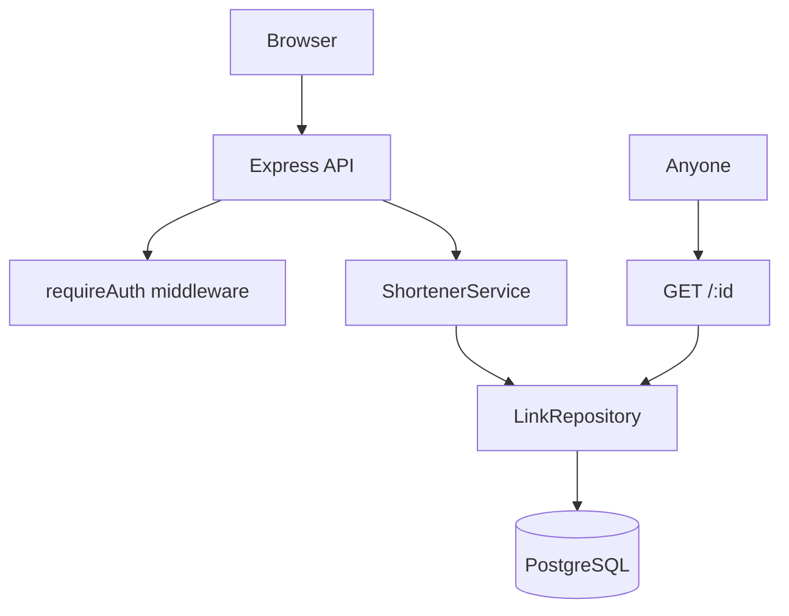
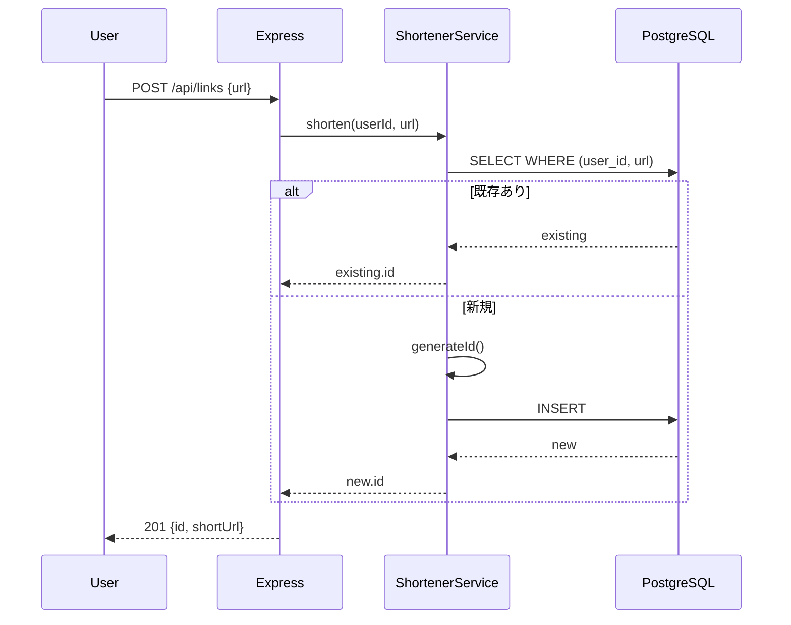
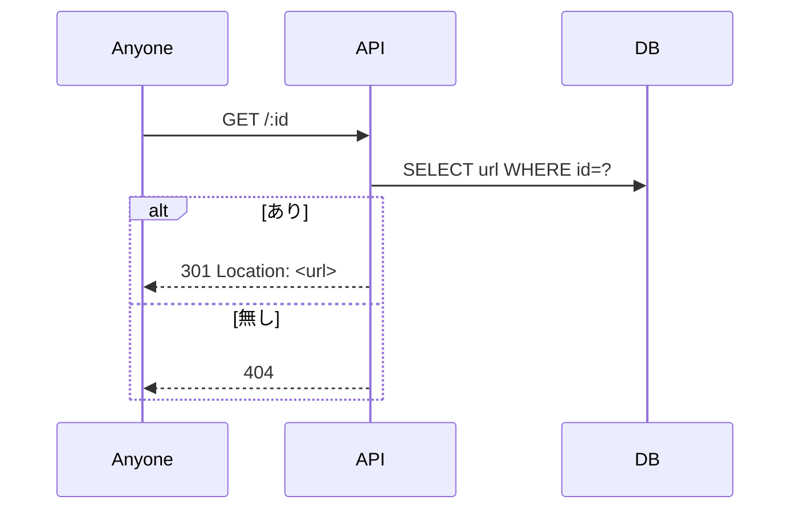
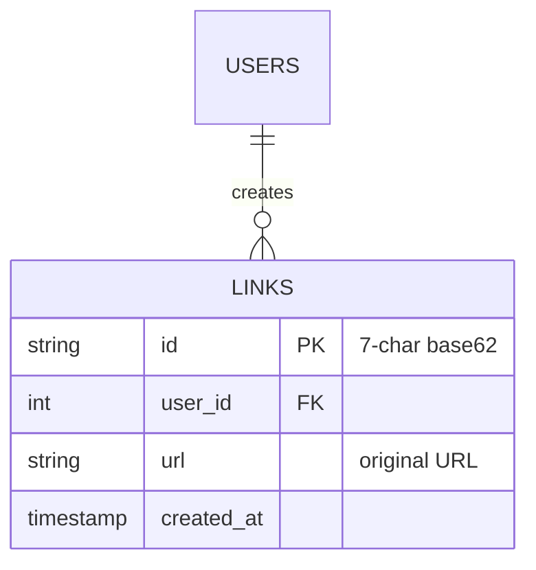

# 基本設計: URL 短縮サービス

最終更新: 2026-04-30
関連: [requirements.md](./requirements.md)

## 1. アーキテクチャ概要

## 2. コンポーネント

### ShortenerService
- 責務: 短縮 ID 生成、URL の正規化、衝突時のリトライ
- 入力: ユーザー ID、元 URL
- 出力: Link オブジェクト (新規作成 or 既存返却)
- 依存: LinkRepository

### LinkRepository
- 責務: links テーブルの CRUD
- 入力: SQL パラメータ
- 出力: ドメイン型 Link
- 依存: PostgreSQL コネクション (Knex)

### Express ルート (`src/routes/links.ts`)
- 責務: HTTP ↔ Service 変換、認証、入力バリデーション
- 入力: HTTP リクエスト
- 出力: HTTP レスポンス
- 依存: ShortenerService、requireAuth

## 3. データフロー

### シナリオ: 短縮作成

### シナリオ: リダイレクト

## 4. データモデル

## 5. 外部インターフェース
- `POST /api/links` — 短縮 URL 作成 (認証必須)
- `GET /api/links` — 自分の履歴取得 (認証必須)
- `GET /:id` — リダイレクト (認証不要)

## 6. エラー処理方針
- 入力 URL が HTTP/HTTPS 以外 → 400 (open redirect 対策)
- ID 衝突 (3 回リトライ後) → 500 (極めて稀)
- 認証無し / セッション切れ → 401
- 存在しない短縮 ID → 404

## 7. 設計判断ログ
| # | 判断 | 採用案 | 却下案 | 理由 |
|---|------|-------|-------|------|
| 1 | ID 形式 | 7 文字 base62 | UUID, 連番 | 短さ・衝突確率・推測困難性のバランス |
| 2 | 重複検出 | (user_id, url) で検索し既存返却 | 常に新規作成 | UX 改善 + DB サイズ抑制 |
| 3 | リダイレクト | 301 (Permanent) | 302 (Temporary) | キャッシュ可能でブラウザ高速化 |
| 4 | 認可境界 | リダイレクトは公開、API は認証必須 | 全て認証必須 | 短縮 URL の利便性のため |
