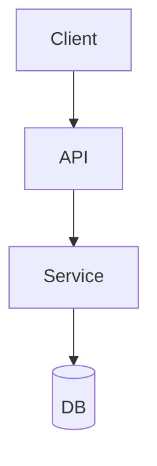
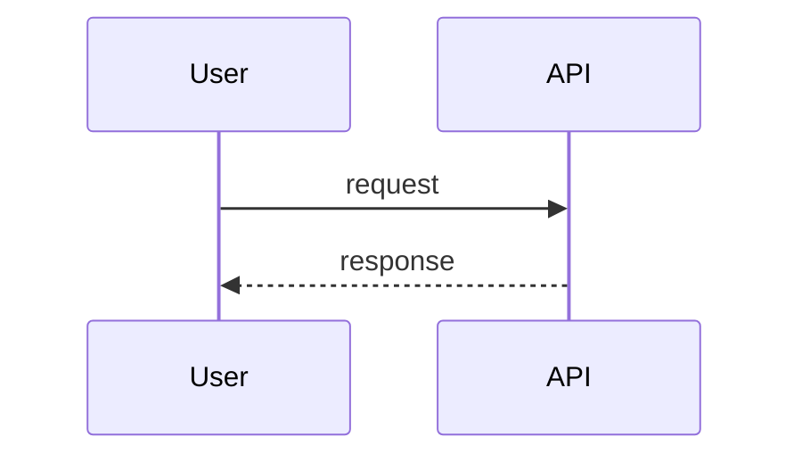
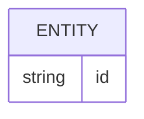

# 基本設計: {{FEATURE_NAME}}

最終更新: {{DATE}}
関連: [requirements.md](./requirements.md)

## 1. アーキテクチャ概要

## 2. コンポーネント
### <コンポーネント名>
- 責務:
- 入力:
- 出力:
- 依存:

## 3. データフロー
### シナリオ: <名前>

## 4. データモデル

## 5. 外部インターフェース
- 

## 6. エラー処理方針
- 

## 7. 設計判断ログ
| # | 判断 | 採用案 | 却下案 | 理由 |
|---|------|-------|-------|------|
