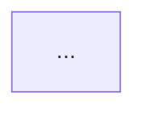

# design — 要件定義・基本設計・詳細設計

## このスキルの役割

開発対象の機能について、以下の3フェーズを順番に進め、ドキュメントとして残す。

1. **要件定義** — 「何を作るか」「なぜ作るか」を確定する
2. **基本設計** — システム全体の構造と振る舞いを設計する
3. **詳細設計** — 実装に必要なクラス・関数・スキーマレベルの設計を行う

成果物は `docs/design/<feature-slug>/` 配下に保存し、後続の `implement` / `verify` Skill が参照する。

## 使い方

ユーザーが機能名を伝えたら（例: 「ユーザー認証を設計して」）、以下の手順で進める。

### ステップ 0: 機能スラグの決定

ユーザーが伝えた機能名から英小文字ハイフン区切りのスラグを生成する（例: 「ユーザー認証」→ `user-auth`）。
判断に迷う場合のみユーザーに確認する。

`docs/design/<feature-slug>/` ディレクトリを作成する。既に存在する場合は中身を読み、既存設計の更新として扱う。

### ステップ 1: 要件定義 (requirements.md)

ユーザーに以下をヒアリングし、不明点は質問する（一気に聞かず、関連する 2-3 個ずつ）。

- **背景・目的**: なぜこの機能が必要か。誰のどんな課題を解くか。
- **スコープ**: やること / やらないこと
- **ユーザーストーリー**: 「〇〇として、〜したい、なぜなら〜」形式で 3-7 件
- **機能要件**: 機能リスト。各機能に受け入れ基準 (Acceptance Criteria) を Given/When/Then で記述
- **非機能要件**: 性能、可用性、セキュリティ、保守性、互換性
- **制約条件**: 技術スタック、外部依存、規約、期限など
- **前提条件**: 想定する環境やデータ状態

書き終えたらユーザーに見せ、合意を得てから次へ進む。

### ステップ 2: 基本設計 (basic-design.md)

requirements.md に沿って以下を記述する。既存コードがあれば必ず読み、整合性を取る。

- **アーキテクチャ概要**: コンポーネント図（Mermaid 推奨）と各層の責務
- **主要コンポーネント**: それぞれの役割、入出力、依存関係
- **データフロー**: 主要シナリオごとのシーケンス図（Mermaid `sequenceDiagram`）
- **データモデル**: 概念モデル / ER 図（Mermaid `erDiagram`）
- **外部インターフェース**: API、CLI、UI など外から見た振る舞い
- **エラー処理方針**: どこでどう扱うか
- **設計判断ログ**: 採用した方針と却下した代替案、理由

書き終えたらユーザーに合意を取る。

### ステップ 3: 詳細設計 (detailed-design.md)

basic-design.md を実装可能な粒度まで落とす。

- **モジュール / ファイル構成**: 新規追加・変更するファイルのツリー
- **クラス・関数仕様**: シグネチャ、パラメータ、戻り値、副作用、例外
- **API 仕様**: エンドポイント、メソッド、リクエスト/レスポンススキーマ、ステータスコード
- **DB スキーマ**: テーブル定義、インデックス、マイグレーション方針
- **状態遷移**: 必要なら状態遷移図（Mermaid `stateDiagram-v2`）
- **疑似コード**: 複雑なロジックは擬似コードで示す
- **テスト観点**: ユニット / 統合 / E2E それぞれで何を検証するか
- **実装ステップ**: 実装順序の提案（依存関係を考慮）

## 成果物テンプレート

### requirements.md

```markdown
# 要件定義: <機能名>

最終更新: <YYYY-MM-DD>
ステータス: ドラフト / レビュー中 / 確定

## 1. 背景・目的
## 2. スコープ
### 対象
### 対象外
## 3. ユーザーストーリー
- US-01: <ロール> として、<やりたいこと>。なぜなら <理由>。
## 4. 機能要件
### FR-01: <機能名>
**説明**: ...
**受け入れ基準**:
- Given <前提>, When <操作>, Then <結果>
## 5. 非機能要件
| カテゴリ | 要件 | 指標 |
|---------|------|------|
| 性能    | ...  | ...  |
## 6. 制約条件
## 7. 前提条件
## 8. オープンイシュー
```

### basic-design.md

````markdown
# 基本設計: <機能名>

最終更新: <YYYY-MM-DD>
関連: [requirements.md](./requirements.md)

## 1. アーキテクチャ概要

## 2. コンポーネント
### <コンポーネント名>
- 責務:
- 入力:
- 出力:
- 依存:
## 3. データフロー
### シナリオ: <名前>
```mermaid
sequenceDiagram
  ...
```
## 4. データモデル
```mermaid
erDiagram
  ...
```
## 5. 外部インターフェース
## 6. エラー処理方針
## 7. 設計判断ログ
| # | 判断 | 採用案 | 却下案 | 理由 |
````

### detailed-design.md

```markdown
# 詳細設計: <機能名>

最終更新: <YYYY-MM-DD>
関連: [basic-design.md](./basic-design.md)

## 1. ファイル構成
## 2. クラス・関数仕様
### `path/to/file.ts`
#### `functionName(args): ReturnType`
- 説明:
- パラメータ:
- 戻り値:
- 例外:
## 3. API 仕様
### POST /api/...
- リクエスト:
- レスポンス (200):
- エラーレスポンス:
## 4. DB スキーマ
## 5. テスト観点
## 6. 実装ステップ
1. ...
2. ...
```

## 進め方の原則

- **一度に全部書こうとしない**。フェーズごとにユーザーと合意を取りながら進める。
- **既存コードを必ず確認する**。設計が現実のコードベースと矛盾していないかチェックする。
- **わからないことは推測せず質問する**。ただし質問はまとめて。
- **Mermaid を活用する**。図はテキストで残し、レビューしやすくする。
- **TaskCreate で進捗を可視化する**。要件→基本→詳細の3段階をタスク化すると進めやすい。
- 過度に詳細な記述は避け、実装者が判断すべき部分は意図的に余白を残す。
